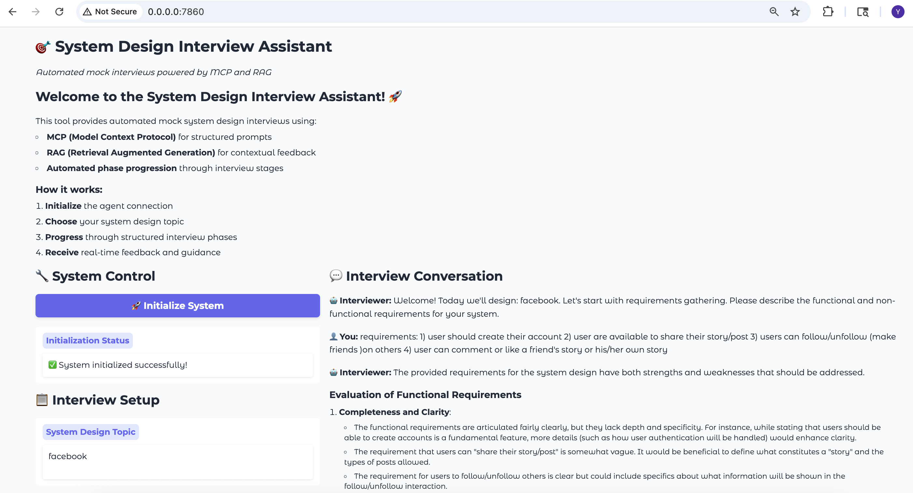
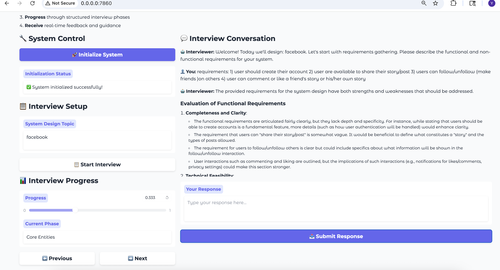

# MCP Tool for System Design Feedback
This project is still building.👷‍♂️

Plan:
- Continue calibrating prompts for different phases of design review
- Self design an agent
</br>

# Version 2.0.1
Change frontend framework from Streamlit to Gradio.
- Streamlit is unable to resolve async responds in a loop.

## Interface of Version 2.0.1



# Version 2.0.0
POC agent added. It leverage [MCP-Agent](https://github.com/lastmile-ai/mcp-agent)
- Use streamlit to build a simple frontend
- It can use RAG to get sample similar answers from HellowInterview
- It automatically chooses prompts provided by server.

## How to use
1. Get the required packages
```bash
pip install -r requirements_client.txt
```
2. Set up configuration
```bash
cp config_client.example.yaml config_client.yaml
```
3. Run the client(agent side)
```bash
python client_app.py
```
4. Open the MCP client and connect to the server
5. Start the review process

# Version 1.0.0
This is a tool to help us to review the design of a system.
- It can use RAG to get example answers from the internet
- It provides prompts for LLM to better review the design

At this phase, it can be used as a MCP server which is tested on Claude Desktop App as MCP client.

## How to use
### User it directly in terminal
1. Get the required packages
```bash
pip3 install -r requirements.txt
```
2. Run the server directly in terminal
```bash
python3 server.py
```
3. Open the MCP client and connect to the server
4. Start the review process
### Directly use it in Claude Desktop App
1. put this config in the claude_desktop_config.json
```json
{
    "system-design": {
            "command": "/Users/{your_user_name}/.local/bin/uv",
            "args": [
                "--directory",
                "{absolute path to your project}",
                "run",
                "server.py"
            ]
        }
}
```